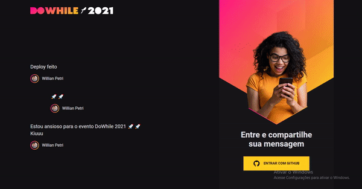

<h1 align='center'>
  NLW Heat
</h1>

<h1 align='center'>
  
</h1>

---

## 🚀 Technologies

This project was developed at the Rocketseat Next Level Week with the following technologies:

- [ReactJS](https://reactjs.org)
- [Typescript](https://www.typescriptlang.org/)
- [sass](https://sass-lang.com/documentation)
- [Axios](https://github.com/axios/axios)
- [socket.io](https://socket.io/)
- [VS Code](https://code.visualstudio.com/) with [EditorConfig](https://marketplace.visualstudio.com/items?itemName=EditorConfig.EditorConfig) and [ESLint](https://marketplace.visualstudio.com/items?itemName=dbaeumer.vscode-eslint)


---

## ⚙ How To Use

```bash

  #Clone this repository
  $ git clone https://github.com/willianPetri/NLW-web.git

  #Go into the repository
  $ cd NLW-web

  #Install dependecies
  $ yarn add or npm install

  #Run Api 
  - API -> (https://github.com/willianPetri/NLW-backend)
  
  #Run the project
  $yarn dev


```

---

Made with ❤ by Willian Petri  [✌ Get in touch!](https://www.linkedin.com/in/willian-petri-84a935135/)
